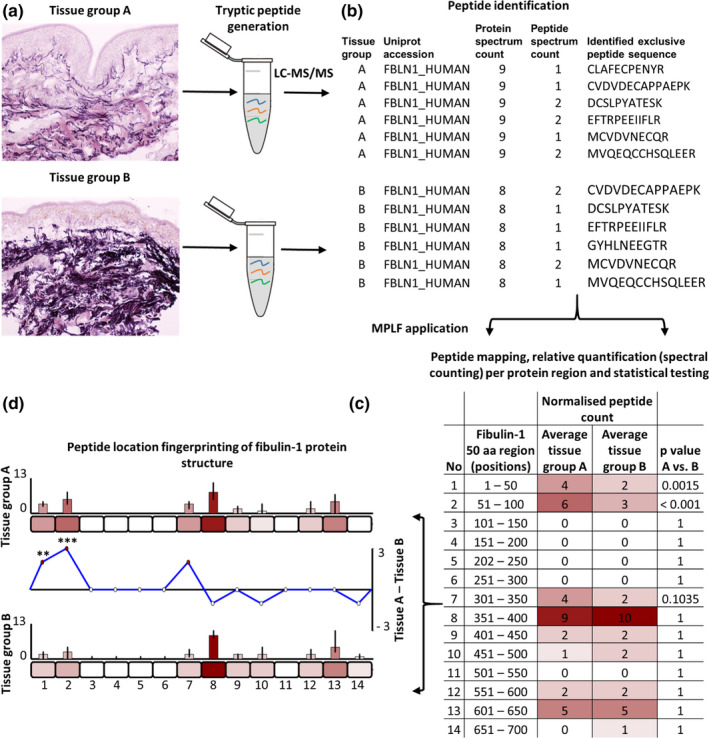

  

**Peptide location fingerprinting (PLF)** is a technique capable of identifying modified proteins and potential causal mechanisms in complex biological samples. In standard proteomics, proteins are trypsinised which generate peptides whose sequence identities and relative abundances are measured by LC-MS/MS. During this process most proteins are only partially digested, due to differing solubilities, stabilities and enzyme susceptibilities related to their higher order structures. By mapping and quantifying LC-MS/MS-detected peptides within specific regions, PLF enables the detection of statistical differences in the regional digestibility along the protein structure due to ageing and disease mechanisms.

## Quick start

### Test data

To just try to run the analysis on test data please run (thats also available for download on our [MPLF website](https://www.manchesterproteome.manchester.ac.uk/#/MPLF) ):

`python PLF.py --test --outname My_Test_Run`

## Your own data

1. Prepeare a file that lists **Protein** name (optional if source protein not determined), **Peptide** sequence (remove any special characters from these), **Sample** of protein belionging and **spectra** (can be multiple columns as per: **spectra_1**,**spectra_2**, etc. -- these will be added up): as per [this file](https://github.com/maxozo/MPLF/blob/mplf_package/Sample_Data/sample_inputs_small/Sample_Data_For_Analysis.csv).

| Protein |	Sample |	Peptide |		spectra |	spectra_2 |	spectra_3 |	spectra_4 |
| -------- |	-------- |	-------- |	-------- |	-------- |		-------- |	-------- |
| FBLN1_HUMAN |	20180601_SherrattM_MO_15.raw (Full_Skin_15) |	CLAFECPENYR  |	0 |	1 |	0 |	0 |
| FBLN1_HUMAN |	20180601_SherrattM_MO_15.raw (Full_Skin_15) |	CVDVDECAPPAEPCGK  |	0 |	1 |	0 |	0 |

2. Prepeare a tsv file that lists the experimental design - as per [this file](https://github.com/maxozo/MPLF/blob/mplf_package/Sample_Data/sample_inputs_small/Experiment_feed.tsv). If paired make sure that the rows list matching pairs, otherwise any order is ok.

| forearm |	buttock |	
| -------- |	-------- |	
| sample1 |	sample2 |
| sample3 |	sample4 |
| sample6 |	sample7 |

3. Run the MPLF pipeline:

  `python PLF.py --experimental_design Experiment_feed.tsv --peptides Sample_Data_For_Analysis.csv --spiecies HUMAN --domain_types DOMAINS,REGIONS,TOPO_DOM,TRANSMEM,REPEAT,50AA,75AA,100AA --paired True --cpus max --outname MPLF_RUN`

          Required:

          --experimental_design  This allows to provide the experimental defign file file

          --peptides   This allows to provide your peptides file

          --spiecies   The spiecies of the peptides

          --paired    Is the samples specified in experimental_design paired or unpaired

          --outname  The name of the output files

          Optional:

          --cpus     (default=max available) How many cpus to use for analysis.

          --p_threshold    (dafault=0.05) Only return proteins that has at least one domain with a significance threshold lover or equal to specified

4. Results will produce two files {outname specified}.tsv and {outname specified}.mplf file. TSV file will list all the domains, their p values, quantified data, normalised data etc. MPLF file can be uploaded to [Manchester Proteome Location Fingerprinter (MPLF)](https://www.manchesterproteome.manchester.ac.uk/#/MPLF) to perform visualisations of the data. 

## Methods
[For details please read our publication](https://www.ncbi.nlm.nih.gov/pmc/articles/PMC8135079/figure/acel13355-fig-0001/)

  

## References (please cite)
* [Eckersley, A. et al. Proteomic fingerprints of damage in extracellular matrix assemblies. Matrix Biol. Plus 5, 100027 (2020).](https://pubmed.ncbi.nlm.nih.gov/33543016/)
* [Ozols, M. et al. Peptide location fingerprinting reveals modification-associated biomarker candidates of ageing in human tissue proteomes. Aging Cell 20, e13355 (2021).](https://pubmed.ncbi.nlm.nih.gov/33830638/)
* [Eckersley, A. et al. Peptide Location Fingerprinting Reveals Tissue Region-specific Differences in Protein Structures in an Ageing Human Organ. Int. J. Mol. Sci. 22, 10408 (2021).](https://pubmed.ncbi.nlm.nih.gov/34638745/)
* [Eckersley, A., Morais, M. R. P. T., Ozols, M. & Lennon, R. Peptide location fingerprinting identifies structural alterations within basement membrane components in ageing kidney. Matrix Biol. 121, 167–178 (2023).](https://pubmed.ncbi.nlm.nih.gov/37437747/)
* [Eckersley, A. et al. Peptide location fingerprinting identifies species- and tissue-conserved structural remodelling of proteins as a consequence of ageing and disease. Matrix Biol. 114, 108–137 (2022).](https://www.sciencedirect.com/science/article/pii/S0945053X22000737)
