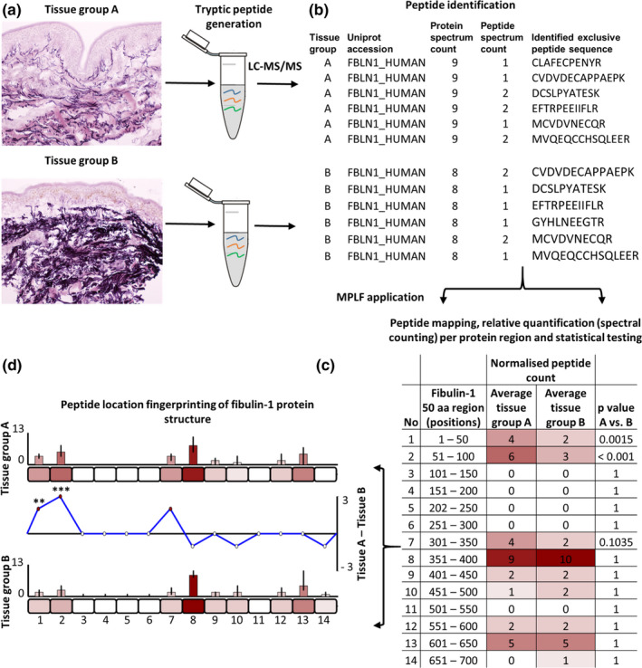

  

**Peptide location fingerprinting (PLF)** is a technique capable of identifying modified proteins and potential causal mechanisms in complex biological samples. In standard proteomics, proteins are trypsinised which generate peptides whose sequence identities and relative abundances are measured by LC-MS/MS. During this process most proteins are only partially digested, due to differing solubilities, stabilities and enzyme susceptibilities related to their higher order structures. By mapping and quantifying LC-MS/MS-detected peptides within specific regions, PLF enables the detection of statistical differences in the regional digestibility along the protein structure due to ageing and disease mechanisms.

## Updates - PLF v2.0 is now launched!

PLF v2.0 contains the following updates and improvements:
* Peptide abundance weighting
  * Previously, whole peptide abundance values were allocated to segments regardless of the degree of overlap. Now in v2.0, peptide abundance values are weighted and allocated to segments proportionally, based on the length of the peptide which overlaps each segment. For example, if a peptide falls across two segments, with 30% of its length in one, and 70% of its length in the other, the peptide abundance value will be split 30:70 and those values allocated to each respective segment. This is repeated for all peptides and thus summed segment values are calculated.
  * Peptide abundance weighting makes PLF v2.0 analysis more accurate.
* New species available for analysis
  * PLF v2.0 can now analyse peptide abundance data from Human, Horse, Mouse, Rat, Rabbit, Zebrafish, Drosophila, and C. Elegans.
  * If you require an different species, please contact us.
* Updated all protein sequence files, now up to date as of UniProt release 2026_01
* Updated and optimised to run in Python v3.13
* Small bug fixes
  * Peptides which start or end exactly on segment limits are now included in analyses.

## Quick start

(see PLF instructions txt file also)

### Installation (Windows)

Python version 3.12 or 3.13 is required

Clone the PLF repo:

          git clone --branch tess_work https://github.com/maxozo/PLF.git

Create a new virtual Python enviroment:

         cd PLF
         python -m venv plf_venv

Alternatively, if have virtualenv installed:

         virtualenv plf_venv

Or create venv with a non-global version of python:

         virtualenv plf_venv --python=python3.12.11

Activate the enviroment (Windows)

         plf_venv\scripts\activate

Install requirements:

         pip install -r requirements.txt

### Test data

For a quick test that the program is functional, run:    (afterwards check that the output files contain data)

         python PLF.py --test --outname My_Test_Run

Example full run with set parameters, using included sample data (open input files to see correct format)

         python PLF.py --experimental_design full_test_feed.tsv --peptides full_test_input.csv --species HUMAN --domain_types 50AA --paired True --outname full_test_output --p_threshold 0.05

### User input options

Options for different segment analyses (--domain_types):

         50AA, 75AA, 100AA, DOMAINS, REGIONS, TOPO_DOM, TRANSMEM, REPEAT

Options for different species (--species):

         HUMAN, HORSE, MOUSE, RAT, RABBIT, ZEBRAFISH, PIG, DROSOPHILA, CELEGANS

### Your own data

1. Prepare a file that lists **Protein** name (optional if source protein not determined), **Peptide** sequence (remove any special characters from these), **Sample** of protein belionging and **spectra** (can be multiple columns as per: **spectra_1**,**spectra_2**, etc. -- these will be added up): as per [this file](https://github.com/maxozo/MPLF/blob/mplf_package/Sample_Data/sample_inputs_small/Sample_Data_For_Analysis.csv).

| Protein     | Sample                                      | Peptide          | spectra | spectra_2 | spectra_3 | spectra_4 |
| ----------- | ------------------------------------------- | ---------------- | ------- | --------- | --------- | --------- |
| FBLN1_HUMAN | 20180601_SherrattM_MO_15.raw (Full_Skin_15) | CLAFECPENYR      | 0       | 1         | 0         | 0         |
| FBLN1_HUMAN | 20180601_SherrattM_MO_15.raw (Full_Skin_15) | CVDVDECAPPAEPCGK | 0       | 1         | 0         | 0         |

2. Prepeare a tsv file that lists the experimental design - as per [this file](https://github.com/maxozo/MPLF/blob/mplf_package/Sample_Data/sample_inputs_small/Experiment_feed.tsv). If paired make sure that the rows list matching pairs, otherwise any order is ok.

| forearm | buttock |
| ------- | ------- |
| sample1 | sample2 |
| sample3 | sample4 |
| sample6 | sample7 |

3.  Run the MPLF pipeline:

         python ../../PLF.py --experimental_design Experiment_feed.tsv --peptides Sample_Data_For_Analysis.csv --species HUMAN --domain_types DOMAINS,REGIONS,TOPO_DOM,TRANSMEM,REPEAT,50AA,75AA,100AA --paired True --outname MPLF_RUN --p_threshold 0.05

Params:

          Required:

          --experimental_design  This allows to provide the experimental defign file file

          --peptides   This allows to provide your peptides file

          --species   The species of the peptides

          --paired    Is the samples specified in experimental_design paired or unpaired

          --outname  The name of the output files

          Optional:

          --cpus     (default=max available) How many cpus to use for analysis.

          --p_threshold    (dafault=0.05) Only return proteins that has at least one domain with a significance threshold lover or equal to specified

5. Results will produce two files **{outname specified}.tsv** and **{outname specified}.mplf** file. TSV file will list all the domains, their p values, quantified data, normalised data etc. MPLF file can be uploaded to [Manchester Proteome Location Fingerprinter (MPLF)](https://www.manchesterproteome.manchester.ac.uk/#/MPLF) to perform visualisations of the data.

6. Optional: run the PLF segment coverage calculator. This will ammend results table with segment coverage - high segment coverage means the quality of the data is better, and results more useable.
       Input file is the name of the PLF results tsv file. Enter experimental conditions as they appear in the experimental feed / PLF results

         python plf_coverage_calc.py --input_file tess_test_output.tsv --condition1 Epi+ --condition2 Epi-

## Methods

[For details please read our publication](https://www.ncbi.nlm.nih.gov/pmc/articles/PMC8135079/figure/acel13355-fig-0001/)

  

## References (please cite)

- [Eckersley, A. et al. Proteomic fingerprints of damage in extracellular matrix assemblies. Matrix Biol. Plus 5, 100027 (2020).](https://pubmed.ncbi.nlm.nih.gov/33543016/)
- [Ozols, M. et al. Peptide location fingerprinting reveals modification-associated biomarker candidates of ageing in human tissue proteomes. Aging Cell 20, e13355 (2021).](https://pubmed.ncbi.nlm.nih.gov/33830638/)
- [Eckersley, A. et al. Peptide Location Fingerprinting Reveals Tissue Region-specific Differences in Protein Structures in an Ageing Human Organ. Int. J. Mol. Sci. 22, 10408 (2021).](https://pubmed.ncbi.nlm.nih.gov/34638745/)
- [Eckersley, A., Morais, M. R. P. T., Ozols, M. & Lennon, R. Peptide location fingerprinting identifies structural alterations within basement membrane components in ageing kidney. Matrix Biol. 121, 167–178 (2023).](https://pubmed.ncbi.nlm.nih.gov/37437747/)
- [Eckersley, A. et al. Peptide location fingerprinting identifies species- and tissue-conserved structural remodelling of proteins as a consequence of ageing and disease. Matrix Biol. 114, 108–137 (2022).](https://www.sciencedirect.com/science/article/pii/S0945053X22000737)
